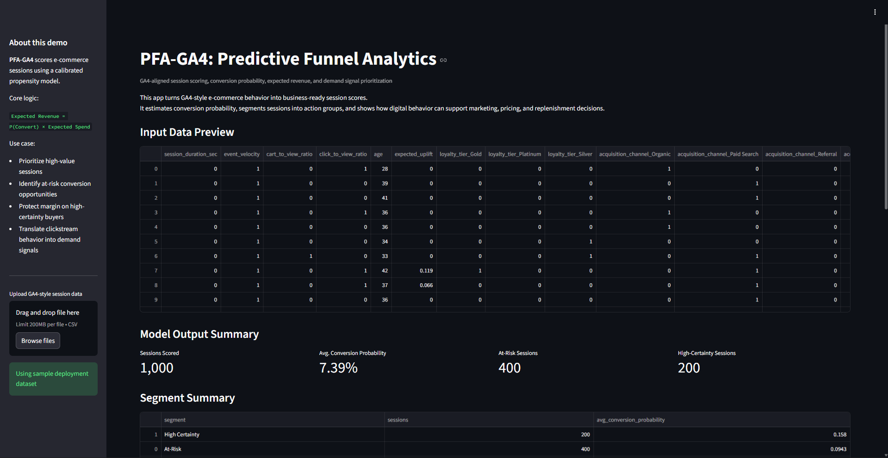

# Predictive Funnel Analytics (PFA-GA4)
### A Decision System for Session Scoring, Revenue Prioritization & Demand Signals

**Repository:** [Predictive-Funnel-Analytics-GA4](https://github.com/rynetroy/Predictive-Funnel-Analytics-GA4)


**Author:** Troy Dela Rosa  
**Tools:** Python · pandas · scikit-learn · XGBoost · SHAP · Streamlit  
**Focus:** Ecommerce Analytics · Conversion Propensity · Revenue Prioritization · Demand Signals · Retail Decision Support


## How to Test This Project

You can validate this project in under a minute.

### Option 1 — No Setup

1. Open:

```text
data/processed/scored_sample_sessions.csv
```

2. Sort by:

```text
expected_revenue
```

3. Compare top-ranked sessions against bottom-ranked sessions.

You should see how high-value sessions are prioritized over low-intent traffic.


### Option 2 — Interactive App

Run the Streamlit app locally:

```bash
python -m streamlit run app/streamlit_app.py
```

The app opens at:

```text
http://localhost:8501
```



Then:

- Click **Load Sample Data**
- View session scoring, segmentation, and demand signals
- Download the scored output


### What to Look For

- Clear separation between high-value and low-value sessions
- Higher conversion concentration in top-ranked groups
- Model outputs translated into business actions, not just scores


## The Problem

In ecommerce:

- Most sessions do not convert
- Marketing spend is often applied too broadly
- Discounts are often wasted on users who would convert anyway
- High-value opportunities are not prioritized

This creates inefficient spend and margin loss.


## The Solution

This project builds a two-stage predictive funnel system that ranks sessions by **expected revenue**, not just conversion probability.

> **Expected Revenue = P(Convert) × Predicted Spend**

This shifts decision-making from:

> “Will they buy?”

to:

> “How valuable is this session?”

The workflow is designed to approximate a GA4-style ecommerce event pipeline, where raw event interactions are aggregated into session-level features for scoring and business prioritization.


## Key Results

| Metric | Result |
|---|---:|
| Baseline conversion rate | 5.16% |
| Top 10% conversion rate | 15.33% |
| Lift | 3.0× |
| ROC-AUC | 0.80 |
| Calibrated expected revenue | $1.97M |
| Actual test revenue | $1.74M |

The model is strongest as a **ranking and prioritization layer**.


## How It Works

### Stage 1 — Conversion Propensity

- **Model:** XGBoost classifier
- **Output:** Probability of purchase
- **Purpose:** Rank sessions by intent

### Stage 2 — Spend Estimation

- Uses customer history instead of session behavior
- Predicts expected basket value
- Separates purchase intent from customer wallet potential

### Final Output

Each session receives:

- Conversion probability
- Predicted spend
- Expected revenue
- Business segment
- Recommended action


## Business Output

| Segment | Meaning | Action |
|---|---|---|
| High Certainty | Likely to convert | Protect margin; avoid unnecessary discounts |
| At-Risk | Persuadable users | Target with selective incentives |
| Monitor | Unclear intent | Wait for stronger signals |
| Low Interest | Low likelihood | Reduce conversion-focused spend |


## Why This Matters

Most analytics projects stop at prediction.

This system connects:

```text
Behavior → Revenue → Action
```

It enables:

- Smarter marketing spend
- Better targeting strategies
- Early demand signal detection
- Alignment between marketing and merchandising


## Key Insight

> **Clicks signal intent. History signals wallet.**

Combining both produces a more complete view of customer value.


## 🛠 Project Workflow

```text
Raw Data
  ↓
Event Aggregation
  ↓
Feature Engineering
  ↓
Conversion Model
  ↓
Spend Estimation
  ↓
Expected Revenue
  ↓
Segmentation
  ↓
Streamlit App
```


## Repository Structure

```text
Predictive-Funnel-Analytics-GA4/
│
├── app/
│   └── streamlit_app.py
│
├── models/
│   ├── pfa_ga4_propensity_model.joblib
│   ├── feature_names.joblib
│   └── customer_spend_lookup.csv
│
├── data/
│   └── processed/
│       └── scored_sample_sessions.csv
│
├── notebooks/
│   ├── 01_modeling_pfa_ga4.ipynb
│   └── 02_deployment_prep.ipynb
│
├── visualizations/
│   ├── header.png
│   ├── streamlit_app_demo.png
│   ├── propensity_decile.png
│   └── revenue_opportunity.png
│
├── README.md
├── requirements.txt
└── .gitignore
```


## Quick Start

Clone the repository:

```bash
git clone https://github.com/rynetroy/Predictive-Funnel-Analytics-GA4.git
cd Predictive-Funnel-Analytics-GA4
```

Install the required libraries:

```bash
pip install -r requirements.txt
```

Run the app:

```bash
python -m streamlit run app/streamlit_app.py
```

The app opens at:

```text
http://localhost:8501
```


## Model Validation Highlights

- Train / validation / test split
- Leakage detection and removal
- Model comparison: Logistic Regression, Random Forest, XGBoost
- Probability calibration using Platt scaling
- Decile lift analysis
- SHAP explainability
- Revenue reconciliation


## Important Notes

- This project uses a synthetic GA4-style ecommerce dataset
- It is designed as a prototype / analytics case study, not a production-ready system
- Propensity does not equal causality; A/B testing is required to measure true incremental lift


## Production Considerations

Before real deployment, this system would require:

- Validation against real GA4 BigQuery export data
- Identity stitching across devices
- Event quality validation
- Attribution logic
- Campaign cost integration
- Model drift monitoring
- Experimentation framework


## About Me

I’m a retail leader transitioning into data analytics, focused on solving real business problems using data.

This project reflects my approach:

> **Not just building models — building decision systems.**
