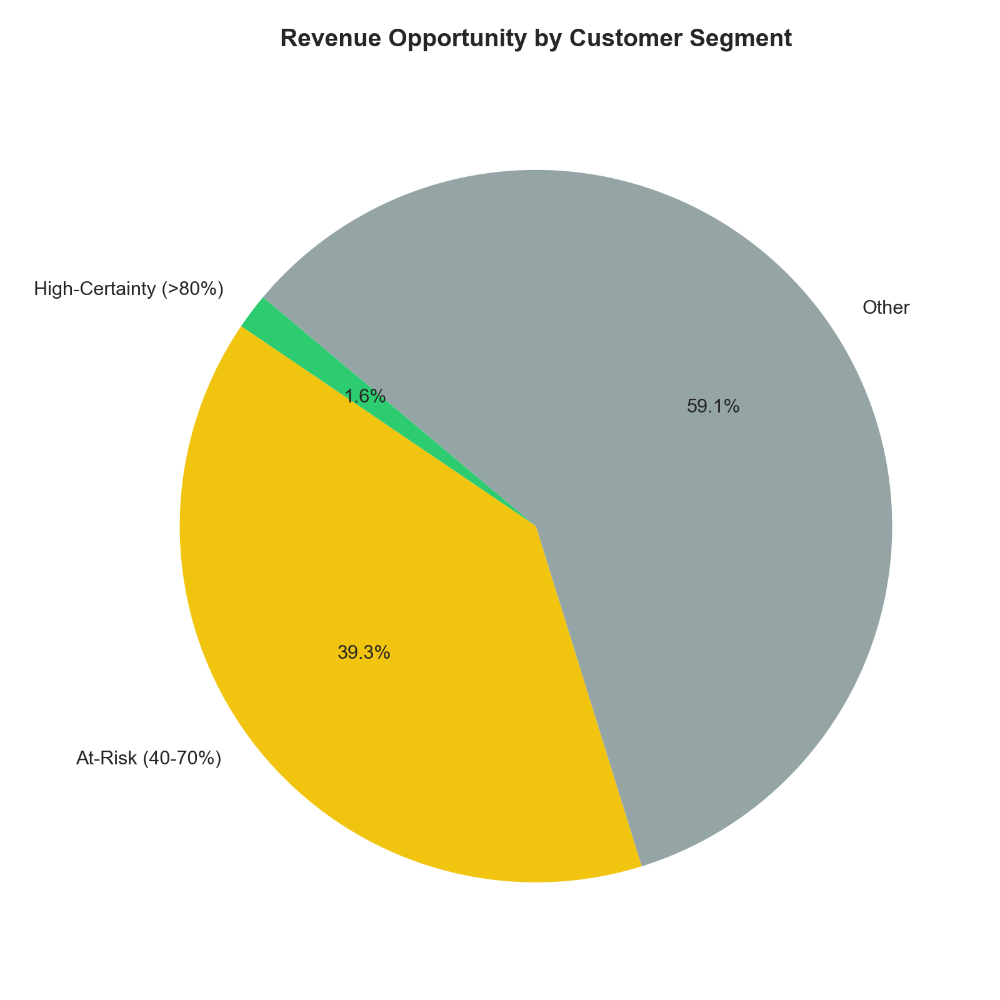
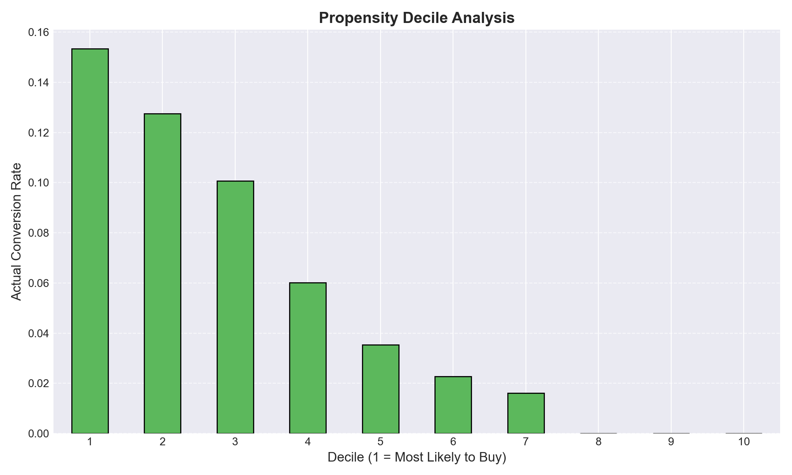

# Predictive Funnel Analytics (PFA-GA4)

### GA4-Aligned Session Scoring & Revenue Opportunity Framework

**Author:** Troy Dela Rosa  
**Tools:** Python · pandas · NumPy · scikit-learn · XGBoost · Matplotlib · Seaborn · Jupyter  
**Focus:** Ecommerce Analytics · Conversion Propensity · Revenue Forecasting

---

## What This Project Does

This project builds a two-stage session scoring system designed to assign a **probability of conversion** and **expected revenue value** to each user session.

The framework enables:

- Identification of high-value users before they convert
- Targeted intervention on at-risk sessions
- Smarter allocation of marketing spend and promotions
- Revenue-based prioritization instead of conversion-only metrics

---

## Key Idea

> **Expected Revenue = P(Convert) × Expected Spend**

Instead of treating all sessions equally, this model estimates **how much each session may be worth**.

---

## Why It Matters

In typical ecommerce funnels, most sessions do not convert. This creates two costly problems:

- High-intent users may drop off without intervention
- Low-value traffic can consume marketing budget

This project addresses both by identifying:

- **Who is likely to convert**
- **Who may need a nudge**
- **Who is not worth targeting heavily**

---

## Approach

### Stage 1 — Conversion Propensity

- **Model:** XGBoost Classifier
- **Output:** Probability of purchase
- **Performance:** ROC-AUC ≈ 0.80 with strong ranking lift

### Stage 2 — Spend Estimation

- **Method:** Historical customer average order value lookup
- **Insight:** Behaviour predicts intent, not spend

### Final Output

- Session-level expected revenue
- Actionable segmentation for marketing, pricing, and merchandising

---

## Architecture Overview

```text
Raw Event Data (GA4-style)
        │
        ▼
Session Aggregation Layer
(events → sessions)
        │
        ▼
Feature Engineering
- Behavioural signals
- Customer attributes
- Campaign context
        │
        ▼
-----------------------------
|   Stage 1: Propensity     |
|   XGBoost Classifier      |
|   P(Convert)              |
-----------------------------
        │
        ▼
-----------------------------
|   Stage 2: Spend Model    |
|   Historical AOV Lookup   |
|   Expected Spend          |
-----------------------------
        │
        ▼
Expected Revenue Calculation
P(Convert) × Expected Spend
        │
        ▼
Segmentation Layer
- High Certainty
- At-Risk
- Low Interest
        │
        ▼
Business Actions
- Promotions
- Bidding
- Merchandising
- Funnel Optimization
```

---

## Example Model Output (Illustrative)

| Session ID | P(Convert) | Expected Spend | Expected Revenue | Segment | Recommended Action |
|---|---:|---:|---:|---|---|
| S-10492 | 0.86 | $124.50 | $107.07 | High-Certainty | Protect margin |
| S-21984 | 0.58 | $96.20 | $55.80 | At-Risk | Trigger incentive |
| S-33871 | 0.12 | $42.00 | $5.04 | Low Interest | Suppress remarketing |

*Values shown are illustrative and meant to demonstrate the hurdle formula in action. Actual scores are generated per session at inference time.*

---

## Segmentation Logic

| Segment | Probability | Recommended Action |
|---|---|---|
| **High-Certainty** | > 80% | Protect margin / no discount |
| **At-Risk** | 40–70% | Trigger incentive / recover demand |
| **Low Interest** | < 40% | Reduce spend / suppress remarketing |



*Distribution of expected revenue across the three propensity segments. The at-risk band is where targeted intervention recovers the most incremental revenue without eroding margin on captive demand.*

---

## GA4 Alignment

This project was structured to approximate a **Google Analytics 4 BigQuery export workflow**.

| Project Field | Comparable GA4 Field |
|---|---|
| `events.csv` | `events_*` tables |
| `event_type` | `event_name` |
| `customer_id` | `user_pseudo_id` |
| `session_id` | `ga_session_id` |
| `purchase_amount` | `ecommerce.purchase_revenue` |

While not run on a live GA4 property, the pipeline was designed to be transferable to GA4-style event data after validating event quality, session logic, identity stitching, revenue fields, and leakage safeguards.

---

## Dataset

**Source:** [Marketing & E-Commerce Analytics Dataset](https://www.kaggle.com/datasets/geethasagarbonthu/marketing-and-e-commerce-analytics-dataset) by Geetha Sagar Bonthu (Kaggle)

**Type:** Synthetic — the dataset is not sourced from a live GA4 property. Its event-based structure was adapted into a GA4-aligned workflow to approximate how session-level funnel modelling could be applied to real GA4 BigQuery export data.

**Scale:**

- ~100,000 customers
- 2M+ interaction events
- 5 relational tables: `customers`, `campaigns`, `events`, `products`, `transactions`

Please refer to the Kaggle page for the dataset's license and any usage restrictions.

> **Note on data files:** The dataset is too large to upload to this repository. To reproduce the analysis, download the files from the Kaggle link above and place them in `data/raw/` alongside the notebook. Processed files in `data/processed/` are regenerated automatically when the notebook runs.

---

## Key Results

- **ROC-AUC ≈ 0.80** on the held-out test set
- Strong top-decile lift vs random targeting
- Revenue opportunity segmentation identified actionable at-risk demand
- Behavioural signals predicted intent better than spend magnitude
- Historical customer-value features improved revenue estimation significantly



*Actual conversion rate by predicted-probability decile. Decile 1 (highest-scored sessions) converts at roughly 3× the base rate — the ranking quality that makes targeted intervention economically viable.*

---

## Core Insight

> **Clicks signal intent — not wallet.**
>
> Session behavior helps predict *whether* someone buys.
> Customer history helps predict *how much* they spend.
>
> That distinction is critical for pricing, bidding, and promotional efficiency.

---

## Project Origin

This repository is a portfolio-enhanced version of the **Predictive Funnel Analytics (PFA)** project originally developed for the **Supervised Machine Learning (SML)** course in the **Data Science & Machine Learning** program at **Red River College Polytechnic**.

The original academic version focused on model training and evaluation. This version reframes the work as a GA4-aligned ecommerce analytics case study to support stakeholder decision-making.
